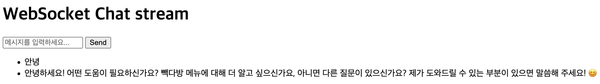

1. install the dependencies
```bash
    uv sync
```
2. ollama model download
```bash
    ollama pull exaone3.5:7.8b
```

3. run the project
```bash
    uv run fastapi dev
```

4. open the browser and go to the following url
```bash
    http://localhost:8000/
```

---

### 간단한 채팅 API 서버
- 간단한 질문에 대한 답변을 하는 AI 채팅
- 질문에 항상 빽다방 정보를 포함하여 빽다방 이외는 답변이 불가능한 단순한 AI 채팅


